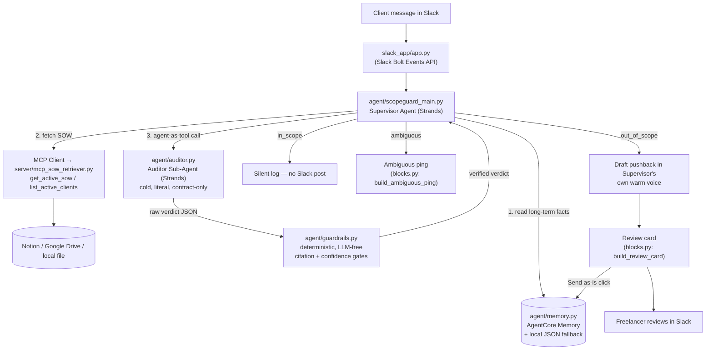

# ScopeGuard

**A background Strands agent that guards a freelancer's Statement of Work — so "can you just quickly add..." stops costing unpaid hours.**

Built for the [Agents for Humans Hackathon](https://awsagenthackathon.devpost.com) — **Professional Agents** track.

[](./LICENSE)
[](https://github.com/strands-agents/sdk-python)
[](https://aws.amazon.com/bedrock/agentcore/)

---

## The problem

Freelancers don't lose money to big disasters. They lose it to Slack messages like:

> "Hey, can you just also add dark mode while you're in there? Shouldn't take long, right?"

It feels rude to say no, so it doesn't get said. A fixed-price website project quietly turns into fifteen unpaid hours, one "quick favor" at a time — and solo freelancers don't have a PM or account manager standing between them and that next favor.

## Who it's for

Independent freelance developers, designers, and consultants working against a fixed-price Statement of Work (SOW) — anyone who negotiates scope directly with clients, in real time, with no one else reading the contract for them.

## Why it matters

The hard part isn't spotting scope creep — clients are usually pretty obvious about it. The hard part is doing it in a way a freelancer can actually **trust**: no hallucinated contract clauses, nothing auto-sent to a client, and no tool that cries wolf on every single message until it gets muted. ScopeGuard is built around that trust problem first, and the scope-detection second.

---

## What it does

ScopeGuard sits quietly in a freelancer's client-facing Slack channels. Every incoming client message is checked against that client's real SOW, in the background, before the freelancer even opens Slack:

| Verdict | What happens |
|---|---|
| ✅ **In scope** | Nothing. No card, no ping, no notification. Silence is the point — a tool that reacts to normal work becomes noise the freelancer learns to ignore. |
| ⚠️ **Ambiguous** | A private, low-key ping to the freelancer: "this needs your judgment," with the reasoning attached. No draft is fabricated when there's nothing solid to stand on. |
| 🛑 **Out of scope** | A **review card** in Slack with four things: the client's raw request, the exact SOW clause it's standing on (copied verbatim, not summarized), a warm/professional drafted pushback that proposes a change order, and three buttons — `Send as-is`, `Edit Draft`, `Discard & Handle Manually`. |

Nothing is ever sent to a client automatically. A human always clicks the button.

---

## Architecture

ScopeGuard is two Strands agents with very different jobs, connected through a deterministic guardrail layer that neither agent can bypass:



### Design decisions that matter

- **Two agents, two temperaments, on purpose.** The **Auditor** (`agent/auditor.py`) is a cold, literal, contract-only instrument — it outputs a strict `verdict / confidence_score / cited_clause / reasoning` schema and nothing else. The **Supervisor** (`agent/scopeguard_main.py`) owns *all* client- and freelancer-facing tone and is warm, diplomatic, and firmly on the freelancer's side. The Auditor's raw output is treated as evidence for the Supervisor to reason from — it is never pasted directly into a client-facing message.
- **Agent-as-tool, not A2A.** The Auditor is wired into the Supervisor as an in-process Strands tool (`run_scope_audit`). Standing up a second protocol server for what is fundamentally in-process reasoning would be unnecessary overhead for this problem.
- **A deterministic, LLM-free guardrail is the sole arbiter of the verdict.** `agent/guardrails.py` never makes a model call. It enforces two independent gates that must *both* pass before a non-ambiguous verdict survives:
  1. **Citation verification** — `cited_clause` must appear as a verbatim (or high-confidence fuzzy, via `rapidfuzz`) substring of the actual SOW text. This is what stops the Auditor from confidently hallucinating a clause that sounds right but isn't in the contract.
  2. **Confidence threshold** — `confidence_score >= 0.85`.

  Either gate failing forces the verdict to `"ambiguous"`, regardless of how confident the model claims to be. This is intentionally the boring, unglamorous part of the system — and it's the part that makes the rest of it trustworthy.
- **A narrow, retrieval-only MCP server.** `server/mcp_sow_retriever.py` exposes exactly two tools — `get_active_sow` and `list_active_clients` — over MCP, backed by Notion, Google Drive (PDF), or a local file per client. It deliberately does **not** expose a chunked/clause-search tool: the Auditor is designed to reason over the full SOW in one pass, not over retrieved snippets, so a partial-context retrieval tool would undermine the citation guarantee above.
- **Dual-stack memory.** `agent/memory.py` talks to **Bedrock AgentCore Memory** when configured (`SCOPEGUARD_MODE=aws` + `AGENTCORE_MEMORY_ID`), and transparently falls back to a local JSON store (`agent/local_memory.py`) when `SCOPEGUARD_MODE=local`, so the whole pipeline runs offline against Ollama for development. Long-term facts (declined offers, scope precedents, agreed changes) are written **only** at the moment a freelancer actually clicks `Send as-is` — never speculatively — and are read back in on every future turn for that client so the Supervisor doesn't re-litigate something already settled.
- **Config-driven client onboarding.** Client → SOW-source and client → Slack-channel mappings live in `config/clients.json`, managed via `common/client_admin.py` (`python -m common.client_admin add/remove/list`). Onboarding a new client is a config change, not a code change or redeploy.
- **Slack-only intake, by design.** `slack_app/app.py` only acts in channels a freelancer has explicitly designated as client channels — never indiscriminately across every channel the bot happens to sit in. Email intake is explicitly out of scope for v1; that's a stated non-goal, not an oversight.
- **AgentCore-ready entrypoint.** `agent/scopeguard_main.py` exposes a `BedrockAgentCoreApp` entrypoint out of the box, so the Supervisor pipeline can be pointed to directly with `agentcore configure -e agent/scopeguard_main.py` and deployed to Bedrock AgentCore with no separate wrapper module.

---

## Project structure

```
scopeguard/
├── agent/
│   ├── scopeguard_main.py   # Supervisor agent, orchestration, AgentCore entrypoint
│   ├── auditor.py           # Auditor sub-agent (agent-as-tool)
│   ├── guardrails.py        # Deterministic, LLM-free verification layer
│   ├── memory.py            # AgentCore Memory client + local fallback dispatch
│   ├── local_memory.py      # Local JSON-backed memory for offline dev
│   └── model_config.py      # AWS Bedrock <-> local Ollama model routing
├── server/
│   └── mcp_sow_retriever.py # Narrow FastMCP server: SOW retrieval only
├── slack_app/
│   ├── app.py                # Slack Bolt Events API app + button handlers
│   └── blocks.py             # Block Kit templates (review card, ambiguous ping)
├── common/
│   ├── client_config.py     # Client onboarding, JSON-backed, hot-reloading
│   └── client_admin.py      # CLI: add / remove / list clients
├── config/
│   └── clients.json          # Client -> SOW source, client -> Slack channel
├── tests/
│   ├── test_auditor.py
│   ├── test_guardrails.py
│   ├── test_eval_harness.py  # End-to-end accuracy against a golden set
│   └── fixtures/
│       ├── sow_acme_website.txt
│       └── golden_set.jsonl
└── docs/
    └── demo_script.md
```

---

## Getting started

### 1. Install dependencies

```bash
python -m venv .venv && source .venv/bin/activate
pip install -r requirements.txt
```

### 2. Configure environment

```bash
cp .env.example .env
```

Fill in `.env`. At minimum, choose a run mode:

- **`SCOPEGUARD_MODE=local`** — no AWS needed. Runs against a local [Ollama](https://ollama.com) model (`LOCAL_MODEL_ID`, default `llama3`) and a local JSON memory store. Good for development and offline demos.
- **`SCOPEGUARD_MODE=aws`** (default) — requires `BEDROCK_MODEL_ID` and AWS credentials; uses Bedrock AgentCore Memory when `AGENTCORE_MEMORY_ID` is set.

SOW sources support Notion, Google Drive-hosted PDFs, or a plain local text file (`--sow-type file`) — the last option needs no external credentials at all.

### 3. Onboard a client

```bash
python -m common.client_admin add \
  --client-id acme-retail-co \
  --sow-type file \
  --sow-ref tests/fixtures/sow_acme_website.txt \
  --channel C0C0TT8CM0W
```

```bash
python -m common.client_admin list
```

### 4. Run the Slack app

```bash
python -m slack_app.app
```

Uses Socket Mode if `SLACK_APP_TOKEN` is set, otherwise starts an HTTP server on `PORT` (default `3000`) for the Events API.

### 5. Deploy to Bedrock AgentCore (optional but recommended)

```bash
agentcore configure -e agent/scopeguard_main.py
agentcore launch
```

---

## Evaluation

`tests/test_eval_harness.py` runs the real Auditor-then-guardrail pipeline (no mocked model) end-to-end against `tests/fixtures/golden_set.jsonl`, and reports:

1. **Overall pipeline accuracy** — fraction of labeled cases where the final, post-guardrail verdict matches the ground truth.
2. **Citation-verification catch rate on adversarial cases** — among golden-set cases where the client references something *not actually in the SOW* (a verbal agreement, a phone call, a DM), the fraction the citation gate correctly forces to `"ambiguous"` even when the Auditor itself returned a confident, non-ambiguous verdict. This is the number that demonstrates the guardrail does real work rather than just rubber-stamping high `confidence_score` values.

```bash
pytest tests/test_eval_harness.py -v      # requires BEDROCK_MODEL_ID / AWS creds, or SCOPEGUARD_MODE=local
pytest tests/test_guardrails.py -v        # fully deterministic, no model calls, no network
pytest tests/test_auditor.py -v
```

`test_guardrails.py` is pure fixture-based unit testing (no mocking, no LLM, no network) and covers the three non-negotiable guardrail behaviors: verified citation + high confidence passes through as-is; verified citation + low confidence is downgraded; and a fabricated/unverifiable citation is downgraded even when the model reports high confidence.

---

## Known limitation (please read before judging the guardrail claims)

`agent/scopeguard_main.py` currently ships with the citation/confidence guardrail **intentionally bypassed** at the routing layer (`run_scope_audit` and `route_guarded_result`, marked `*** HACKATHON DEMO BYPASS ***` in code) so that a local 8B Ollama model — which struggles with perfect character-for-character citation copying — reliably produces a review card during a live demo instead of silently degrading everything to `"ambiguous"`.

The guardrail logic itself (`agent/guardrails.py`) is fully implemented, unit-tested, and does real work — see `tests/test_guardrails.py` and the eval harness above, both of which exercise it directly. Wiring it back into the live routing path (removing the two bypasses) is the first thing to do before this runs against a production-grade model where exact citation copying is reliable.

---

## Track & judging alignment

- **Track:** Professional Agents — ScopeGuard targets a repetitive, judgment-heavy task (reading every client message against a contract) that eats a freelancer's day, and runs in the background rather than as another app to open and manage.
- **Technological Implementation:** two purpose-built Strands agents (Supervisor + Auditor via the agent-as-tool pattern), a narrow custom MCP server for SOW retrieval, `structured_output` for strict schema enforcement, a fully deterministic guardrail layer, dual-stack AgentCore Memory, and an AgentCore-ready entrypoint.
- **Design:** a complete Slack-native product experience — silent pass-through, an ambiguous-case ping, and a four-element review card with real actions — not just a CLI proof of concept.
- **Potential Impact:** targets a specific, universal freelancer pain point (unpaid scope creep) with a concrete mechanism (verbatim citation + human-in-the-loop send) rather than a vague "AI negotiation assistant."
- **Creativity & Originality:** the cold-Auditor / warm-Supervisor split, and the deterministic guardrail that neither agent can talk its way around, is a direct, structural answer to the well-known failure mode of LLM agents citing sources that don't exist.

---

## License

MIT — see [LICENSE](./LICENSE).
